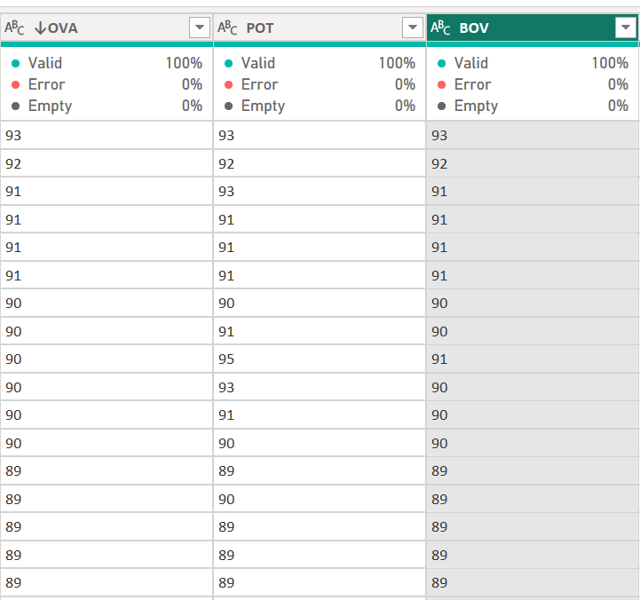

# Fifa2021-Data-Cleaning-Task


## Introduction


This documentation entails the Data cleaning process of the FIFA 21 data set, sourced [kaggle.com](https://www.kaggle.com/) The raw data; **“fifa21 raw data v2.csv”** was used for the Data cleaning task. Power Query Editor for PowerBI was used to complete this process.


## Data Description

The FIFA 21 dataset contains 18,979 rows and 77 columns. The dataset included various data types, including whole numbers, text, and dates. The columns contain information about players such as statistics, positions, photo-URL, earnings, Nationality, clubs,  performance metrics, etc.

## Problem statements

- What is the contract duration years?
- What players are on loan or free contract?
- What are the players' values, Wages, and Release clauses in Dollars?
- What are the players’ heights in (cm) and Weights in (lbs)?


## Data Cleaning Process

I used M language and other power query features to clean and transform the data set to be cleaned and ready for further analysis.


## Photo URL correction

The original URL links contain an error that made the link invalid, and unable to provide the players' photos. I noticed the links contain **“.com” and “_60”**  which are supposed to be **“.net” and “_240”**. For example, ([original link](https://cdn.sofifa.com/players/158/023/21_60.png)) - invalid.  

To fix the error, I corrected the link by replacing **“.com” and “_60”**  with **“.net” and “_240”** using replace value function.  For example, ([corrected link](https://cdn.sofifa.net/players/158/023/21_240.png)) - valid.


Before                    | After
:------------------------:|:----------------------:
| 


By fixing the error, the photo url column is cleaned and improved to serve its purpose


## OVA, POT, and BOV Transformation

These columns contain values that are meant to be in percentage. However, each column represented the values as text data types. Therefore, I converted the values in each column to percentages by dividing the values by 100 and changed the data type to percentage measures. [_see the preview below_] :point_down:


Before :confused:           | After  :blush:
:--------------------------:|:------------------------:
| 


By applying this transformation, the columns are cleaned, accurate, and useful for analysis.


## Contract Column Transformation

The “Contract” column contains the contract Start year, contract End year ( separated by “~”),  values “Free” (for players on a free transfer), and “Loan” (for players on Loan).To clean this column, the first step is to categorize the players based on their agreements with their various clubs.


 _The preview below shows the original contract column before transformation_
 
                              
    
   


 An “Agreement” column was created using a conditional column to show the agreement terms of the players (i.e. Players on 'contract' or 'free' or loan').   _See the preview below_:point_down:
 
 
 
 
 Then, the Agreement column was created 
 
 
 
 
 
Then, another column was created to show the Duration years of the players with contracts only. This transformation is applied by subtracting the start years from the end years. 


This was done using the query below:

`If Text.contains([contract], “~”) then Number.from(Text.AfterDelimiter([contract], “~”)) - Number.From(Text.BeforeDelimiter([contract],”~”)) else [Agreement]`


The transformation used the Text.BeforeDelimiter and Text.AfterDelimiter functions to extract the contract years and find the difference to give the Duration years of each player on contract.


Before                      |  After
:--------------------------:|:--------------------:  
     | 
 
 
 
 By applying these transformations, the “contract” column was cleaned and standardized to include the agreement terms( “contract” or“Free” or “Loan”) and contract duration years of each player which improved the quality of the data.
 
 
 
 
 
 
# Height and Weight columns Transformation

The “Height” column and “Weight” column contain data that needed to be converted to a consistent unit of measurement.


**Unclean Height and Weight Columns**


## Height column

The Height column has some data in centimeters (cm) and some in feet and Inches (ft&in). The aim of this transformation is to convert the “ft” and “in”  to “cm”. The steps to achieve this are the following.

1. Extract the ft and in from the column using Text. contains function
2. Separated the feet and inches values using Delimiters functions
3. Covert the feet value to Centimeter by multiplying by 30.48 (Standard Unit)
4. Convert Inch value  to Centimeter by multiplying by 2.54 ( Standard Unit)
5. Sum the converted Feet and Inches to get the final Height in centimeters(cm)

The above steps are done by this query:

`If Text.contains([Height],”cm”) then Number.From(Text.BeforeDelimiter([Height], “cm”)) else Number.Round(NUmber.FromText(Text.BeforeDelimiter([Height], “‘“))*30.48 + Number.FromText(Text.AfterDelimiter([Height],”’”))*2.52)`


## Weight column

Some values were in Kilogram (kg) and some in Pounds (lbs). The aim is to convert values in (Kg) to (lbs). To achieve this the following steps were taken:

1. Extract the values in Kg by Text.contains functions
2. Covert the extracted values by multiplying them by 2.205 (Standard Unit)


Here is the query to achieve this:

`If Text.contains([Weight], “kg”) then Number.Text(Text.BeforeDelimiter([Weight],”kg”))*2.205 else Number.From(Text.BeforeDelimiter([Weight],”lbs”))`


## Cleaned Height and weight columns :smiley:

                         

      


Both columns are cleaned and accurate by ensuring all values have the same unit of measurement in order to aid further analysis.


# Values Wages and Release clause columns

Data in these columns contained the Euro (€) sign and values were entered in different formats. The following steps were taken to clean the data:

1. The Euro sign was removed from the Value, Wages, and Release Clause columns using the Text.Replace function.
2. The values were then converted to numeric format using the Number.FromText function.
3. The values were converted to their respective units, i.e., M for million and K for thousand, as follows:
4. Values in millions were represented by M (e.g., 1.6M instead of 1600000).
5. Values in thousands were represented by K (e.g., 2K instead of 2000).
6. Finally, the values were converted to Dollars ($)


The following code was used to implement these changes:

## Player Value


```
Let

Replace_Euro = Text. Replace ([Value], “€”, “”),
Convert_value = if Text.contains([Replace_Euro], “M”) then Number.FromText(Text.BeforeDelimiter([Replace_Euro], “M”)) *1000000 else if Text.contains([Replace_Euro],”K”) then Number.FromText(Text.BeforeDelimiter(Replace_Euro],”K”))*1000 else Number.FromText([Replace_Euro])

In
Convert_value *1.06

```

 
 Before                   | After
:------------------------:|:--------------------------:
        | 


## Player Wages

```
Let

Replace_Euro = Text. Replace ([Wage], “€”, “”),
Convert_value = if Text.contains([Replace_Euro], “K”) then Number.FromText(Text.BeforeDelimiter([Replace_Euro], “K”)) *1000 else Number.FromText([Replace_Euro])

in

Convert_value * 1.06

```


   
   Before                 |  After
:------------------------:|:-----------------------:
         |   


## Player Release Clauses

```
Let

Replace_Euro = Text. Replace ([Release clause], “€”, “”),
Convert_value = if Text.contains([Replace_Euro], “M”) then Number.FromText(Text.BeforeDelimiter([Replace_Euro], “M”)) *1000000 else if Text.contains([Replace_Euro],”K”) then Number.FromText(Text.BeforeDelimiter(Replace_Euro],”K”))*1000 else Number.FromText([Replace_Euro])

In
Convert_value *1.06

```


Before                    | After
:------------------------:|:-----------------------:
       |  


## W/F, SM and IR columns Transformation

These three columns have a star "★" symbol added to the values. I replaced the star with blank by using the replace value function and then changed the data type to the whole number. Therefore, the column is cleaned and transformed to be used for analysis.


Before                    | After
:------------------------:|:-----------------------:
 |      


## Hits column Transfromation

The Hits column has a single inconsistency (i.e. it has a value represented as 1.6k instead of 1600). To fix this, the "K" is replaced with blank, and the value is multiplied by 1000 thereby giving the resulting figure.


Before                    |  After
:------------------------:|:-----------------------:
     |   


## Summary :sunglasses:


This project highlights the importance of a thorough data cleaning process, which is pertinent in Data Analytics. The data were properly cleaned, standardized, and improved to be ready for further analysis, modeling, and Visualization.


# Analysis and Visualization

The insights gained from this dataset are the following:

- The top ten Players with the highest wages
- Player worth by continent
- Top 5 clubs with the most valuable players
- Distribution of players by Agreement
- Players values by Age range
- Distribution of players by best position

## Visualization

The visualization is two-phased: The insight main phase, which contains the Analysis, and the profile phase where the players' profiles are visualized. find below the video illustration 


  


 
 
 
 
 
 

 
 
 
 
 
 


